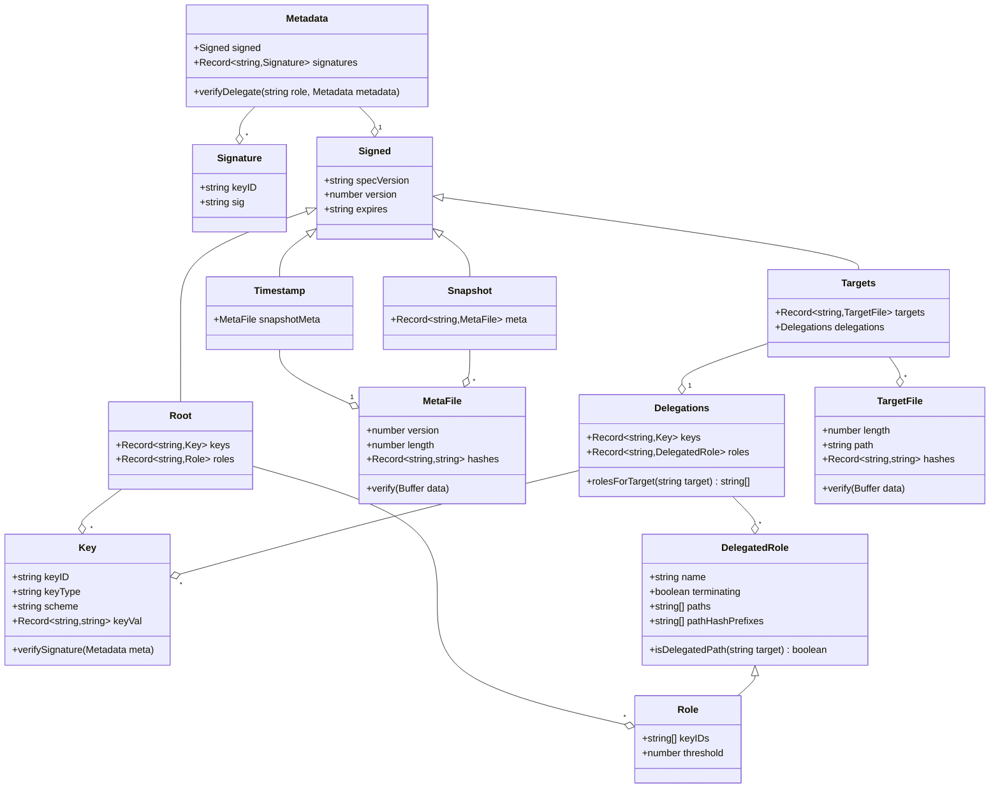

to run the example hitting local tuf server:

1. `python3 -m http.server -d tuf_local_data`
2. go to another terminal`cd examples/clientExample`
3. `npx ts-node clientExample.ts $filename`

to run the example hitting sigstore remote tuf server:

1. go to another terminal`cd examples/clientExample`
2. `npx ts-node clientExample.ts $filename`

## Data Model

